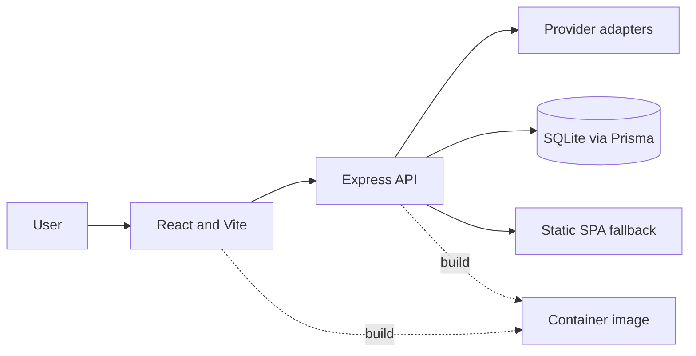

# Free Models Rating

[](https://nodejs.org/en/docs)
[](https://react.dev/)
[](https://vite.dev/guide/)
[](https://docs.docker.com/build/building/multi-stage/)


> Compare free AI models by capability, provider, and practical fit before you build on them.

Free Models Rating is a small dashboard for reviewing free AI model availability across providers. It combines a React interface, an Express API, provider adapters, health checks, feedback, and a persistent SQLite database in one deployable application.

## Overview

The project is intended for developers and researchers who need a clear shortlist of free models instead of manually comparing provider catalogs. The application records model and provider metadata, checks provider health, and presents the result through a single web interface.

The free tier of an upstream provider can still be rate-limited or unavailable. This project reports observed availability; it does not guarantee upstream capacity.

## Project anatomy

```text
client/                 React and Vite frontend
server/                 Express and TypeScript backend
server/src/routes/      Model, provider, feedback, refresh, and notification APIs
server/src/services/    Provider adapters and health checks
server/prisma/          Prisma schema and local SQLite location
docs/architecture/      Public architecture graph
docs/deployment/        Portainer deployment guide
Dockerfile              Multi-stage production image
docker-compose.yml      Registry-image deployment stack
docker-compose.dev.yml  Local build stack
```

## Architecture

The frontend is compiled with Vite and the backend serves the compiled SPA together with `/api/*`. Provider adapters isolate external API formats from the application routes. Prisma persists model, provider, feedback, health, and notification data in SQLite.



The complete graph is maintained in [`docs/architecture/project-graph.mmd`](docs/architecture/project-graph.mmd).

## Tech stack

| Category | Technology | Purpose |
| --- | --- | --- |
| Frontend | React 18 | Dashboard UI |
| Frontend build | Vite 6 | Development server and production build |
| Backend | Express 4 | HTTP API and SPA hosting |
| Language | TypeScript | Frontend and backend implementation |
| Persistence | Prisma 5 + SQLite | Model, provider, feedback, and health data |
| Runtime | Node.js 20 | Application and container runtime |
| Deployment | Docker Compose + Portainer | Repeatable container deployment |

## Installation

Requirements: Node.js 20, npm, and Docker for container execution.

```bash
npm ci
npm run build
```

For local development, configure an ignored `.env` from [`.env.example`](.env.example), then run the workspace commands:

```bash
npm run dev:server
npm run dev:client
```

## Configuration

Required runtime variables:

- `PORT` — internal HTTP port, normally `3000`;
- `NODE_ENV` — `production` or `development`;
- `DATABASE_URL` — SQLite connection string;

Provider credentials are optional and should be configured only for providers that are actually used. The complete safe variable list is in [`.env.example`](.env.example). Never commit a real `.env` file.

## Docker

Build and run locally with the development Compose file:

```bash
docker compose -f docker-compose.dev.yml build
docker compose -f docker-compose.dev.yml up -d
```

For Portainer, use the registry-image stack in `docker-compose.yml`. Set the Stack variables described in [`docs/deployment/portainer.md`](docs/deployment/portainer.md). The database volume must survive image updates.

## Verification

The application health endpoint is:

```text
/api/health
```

Before deployment, verify:

```bash
npm run build
docker compose -f docker-compose.yml config
```

The upstream provider response remains outside this repository's control; a provider may return rate limits even when the application itself is healthy.

## Security boundaries

- Real credentials belong in local ignored `.env` files or Portainer Stack variables.
- The repository must not contain API keys, encryption keys, certificates, private URLs, internal host paths, databases, or deployment archives.
- Provider credentials are read only by the server from its runtime environment and never returned by the API.
- The first administrator is created through a one-time setup link in the container log; the password is stored only as a hash.
- The runtime image uses a non-root user.
- Do not expose the database volume or application secrets through bind mounts.

## Documentation

- [Portainer deployment](docs/deployment/portainer.md)
- [Architecture graph](docs/architecture/project-graph.mmd)

## Tags / Keywords

`ai-models` `free-models` `model-catalog` `react` `express` `typescript` `prisma` `sqlite` `docker` `portainer` `provider-health`

<details>
<summary>README history</summary>

No previous public README revision exists in the source directory. The first release history entry will be added after the initial Git commit.

</details>

<p align="right">Created by <a href="https://github.com/oxotn1k">oxotn1k</a></p>
